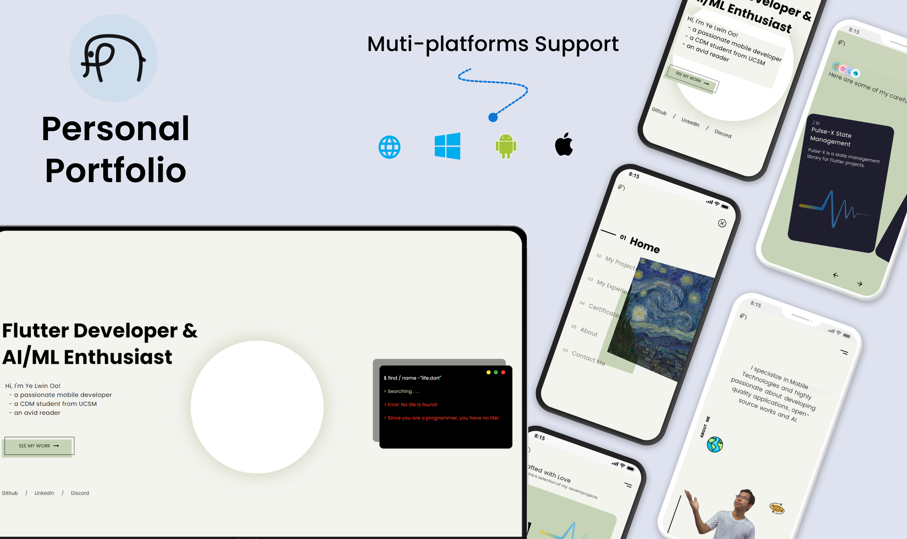

# Personal Portfolio

My Personal Portfolio website made with Flutter 🍃🍒❤️

## 📑 Overview

This is my personal portfolio website built with Flutter - available for multiple platforms : website , android, ios and windows

### 🗝️ Key Features: 
- Home Page
- Projects Page
- Project Details Page
- Experiences Page

[//]: # (- Certificates Page)
- About Page

[//]: # (- Contact Me Page)
- Firebase Integration

[//]: # (### 🔗 Preview Links:)

[//]: # ()
[//]: # (- 🕸️ [Web Version: https://ye-lwin-oo.vercel.app]&#40;https://ye-lwin-oo.vercel.app&#41;)

[//]: # (- 📱 [Mobile Version]&#40;http://u.pc.cd/oJ17&#41;)

### 🪪 Project License:
This project is licensed under [BSD 3-Clause License](LICENSE).

[//]: # (### Want a short preview?)

[//]: # ()
[//]: # (![Walkghrough video]&#40;assets/images/thumbnails/portfolio_peek.gif&#41;)
[//]: # 

Feel free to check it out and give it a ⭐ if you like it. 
Follow me for more updates and more projects ...

Copyright (©️) 2025 RicProfile
# RicProfile
